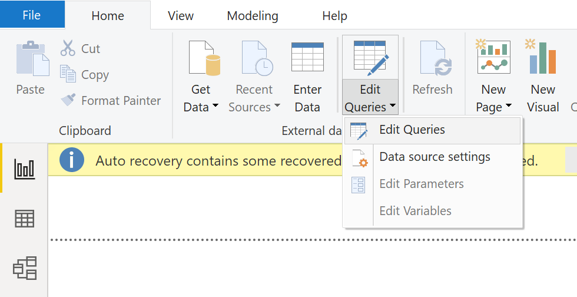
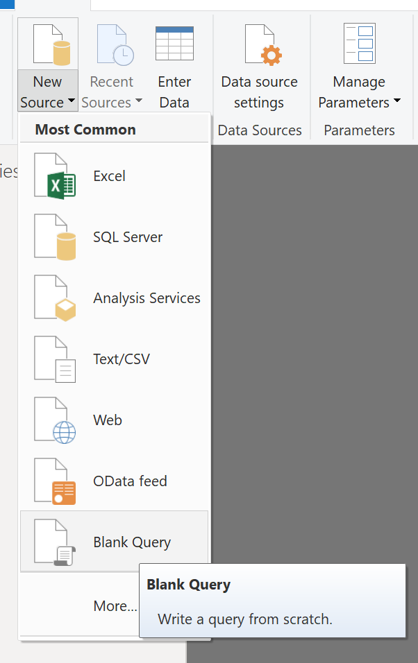
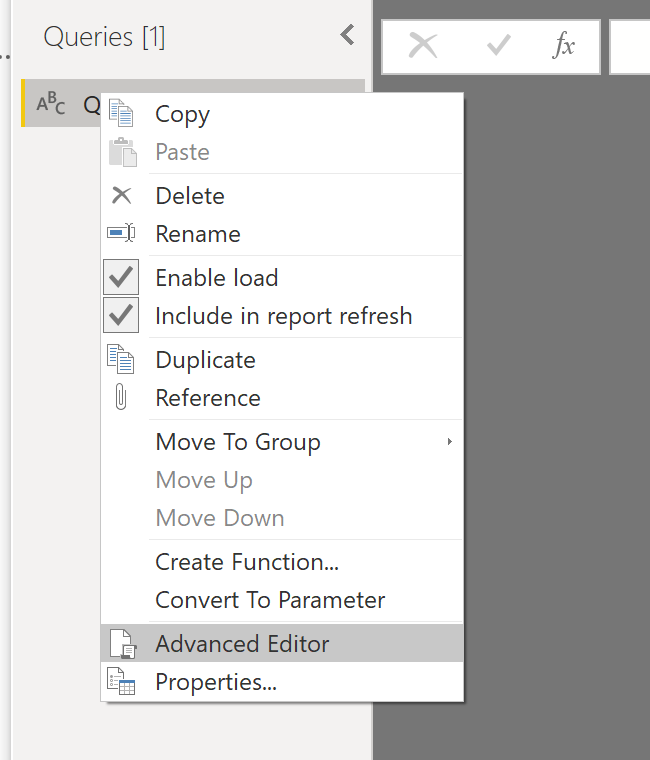
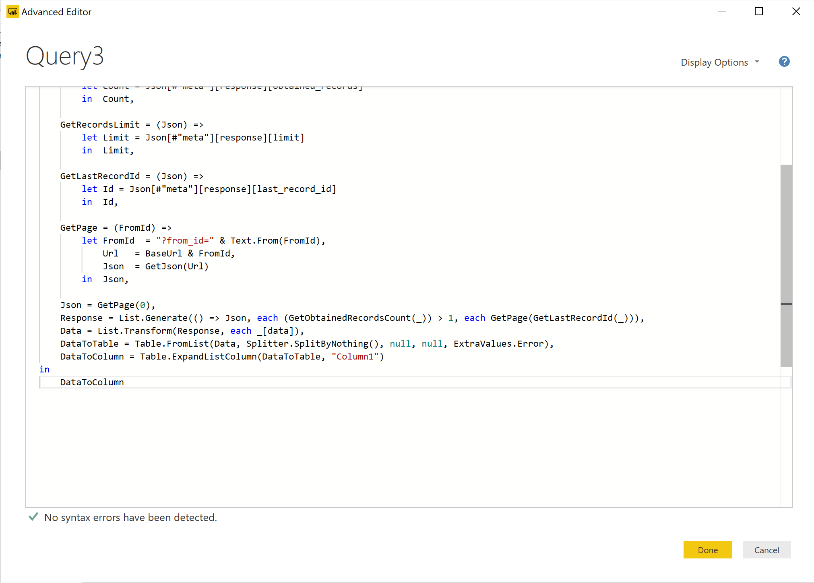
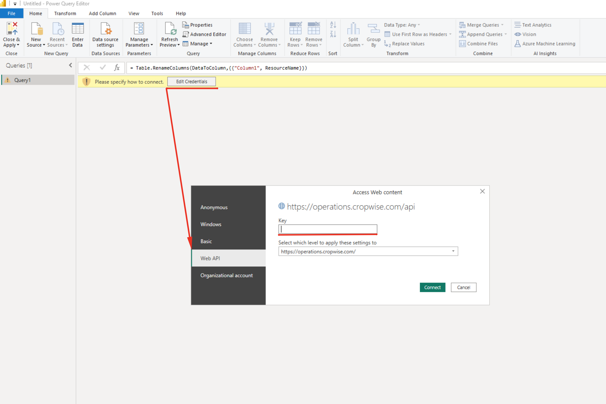
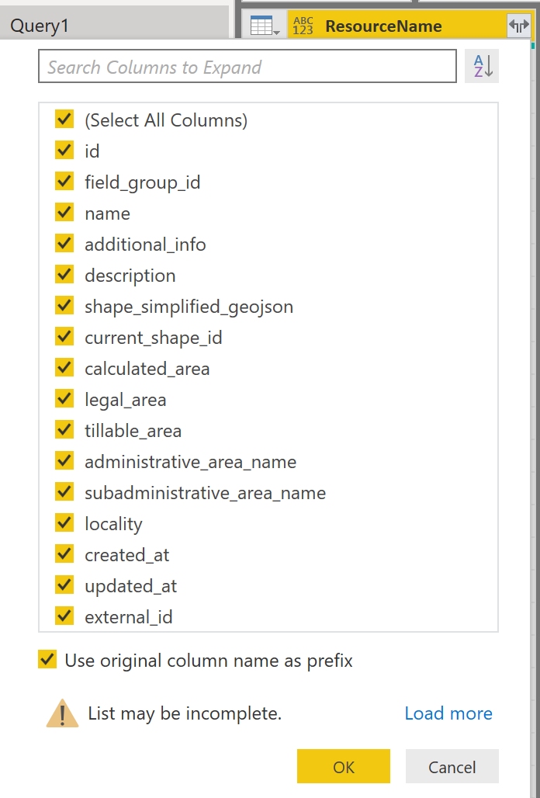
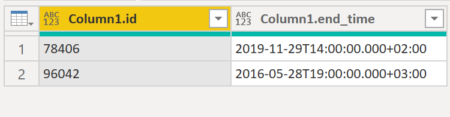

# cropio-powerbi
PowerBI examples to work with Cropio HTTP API

> Using examples of PowerBI scripts requires installed PowerBI Desktop application.
> You can download this application from official [Microsoft page](https://powerbi.microsoft.com/en-us/desktop/).

# General workflow

## Step 1: Open PowerBI Desktop app and find **Edit Queries** navigation button as on the screenshot below:



## Step 2: Find *New Source* navigation button and Select *Blank Query*.



## Step 3: Right click on created Query1 and select *Advanced Editor* option.



## Step 4: Fill in the editor with your code and press *Done* button to complete.



## Step 5: Add Cropio API Token (X-User-Api-Token) to PowerBI credentials

PowerBI will request you to enter credentials to authrozie queries to Cropio API.
1. Press on **Edit credentials** button.
1. Press on **Web API** tab.
1. Insert Cropio API Token (X-User-Api-Token) into **Key** field.
1. Check that settings apply to **https://cropio.com/api**.
1. Press **Connect** button to proceed.

PowerBI will save credentials. This step should be done only once.



## Step 6: After running script Select the column split icon in the ResourceName header. Select columns what you need and select **OK** button.



# Scripts examples

## Obtaining API token with login and password

User must make Login action and obtain **X-User-Api-Token** token.

This token should be obtained only once. Then it must be added to PowerBI credentials,
as specified in **Step 5: Add Cropio API Token to PowerBI credentials**.

More details about Cropio API authotrization: https://cropioapiv3.docs.apiary.io/#reference/authentication/login-request.

### How to obtain X-User-Api-Token

> Note: login action do not require token. If PowerBI will ask **Edit Credentials**, you could
> temporary specify empty **Key**.

- Put example code (below) into **Advanced Editor** and
- Replace `USER-EMAIL` and `USER-PASSWORD` with your own credentials.
- Press **Done** button in **Advanced Editor**.
- You should get response data with record containing `token` row.
- This request should be done only once. After you had receive token, Query should be deleted.

```PowerQuery
let
  // Resource name from Cropio API reference.
  ResourceName = "sign_in",

  // Base Cropio API URL
  BaseUrl = "https://cropio.com/api/",

  // Cropio API version.
  ApiVersion = "v3",

  // Relative resource path for API request.
  RelativeResourcePath = ApiVersion & "/" & ResourceName,

  // Important! -> Replace USER-EMAIL and USER-PASSWORD with your own credentials <-.
  RequestBody = "{ ""user_login"": { ""email"": ""USER-EMAIL"",  ""password"": ""USER-PASSWORD""} }",

  // Build Request.
  RequestOptions = [
    Headers = [
      #"Content-Type" = "application/json"
    ],
    RelativePath = RelativeResourcePath,
    Content = Text.ToBinary(RequestBody)
  ],

  // Get data from Cropio API server.
  Response = Web.Contents(BaseUrl, RequestOptions),

  // Parse response from JSON.
  Source = Json.Document(Response)
in
  Source
```

## Get full list of Fields

> NOTE: Without adding **X-User-Api-Token** to PowerBI Credentials, Query won't work.

> NOTE: You can choose any valid resource instead of `fields`. Example: `ResourceName = "agro_operations"`.
>
> List of available resources you can find at [Cropio API reference description](https://cropioapiv3.docs.apiary.io/).

> NOTE: This example would iterate over pages in Cropio API to
> get full list of records (not only first 100 or 1000).

PowerBI example for list of Fields:
```PowerQuery
let
  // Cropio API reference: https://cropioapiv3.docs.apiary.io/

  // Resource name from Cropio API reference.
  // Change to resource name you want to extract data from.
  ResourceName = "fields",

  // Additional query parameters for filtering/sorting.
  // Available filtering and soring options should be taken from Cropio API reference.
  // If not needed, leave empty record [].
  AdditionalQueryParameters = [
    // Add parameters here.
    // Example:
    // updated_at_gt_eq = "2021-01-01 00:00"
  ],

  // Base Cropio API URL
  BaseUrl = "https://cropio.com/api/",

  // Cropio API version. By default, "v3". Sometimes may be "v3a" or "v3b".
  // Should be taken from Cropio API reference.
  ApiVersion = "v3",

  // Relative resource path for API request.
  ResourceRelativePath = ApiVersion & "/" & ResourceName,

  GetJson = (QueryParams) =>
    let Options = [
      ApiKeyName = "user_api_token",
      RelativePath = ResourceRelativePath,
      Query = QueryParams
    ],
    RawData = Web.Contents(BaseUrl, Options),
    Json = Json.Document(RawData)
    in Json,

  GetPage = (FromId) =>
    let QueryParams = AdditionalQueryParameters & [from_id=Text.From(FromId)],
    Json = GetJson(QueryParams)
    in Json,

  GetObtainedRecordsCount = (Json) =>
    let Count = Json[meta][response][obtained_records]
    in Count,

  GetRecordsLimit = (Json) =>
    let Limit = Json[meta][response][limit]
    in Limit,

  GetLastRecordId = (Json) =>
    let Id = Json[meta][response][last_record_id] + 1
    in Id,

  Json = GetPage(0),
  Response = List.Generate(() => Json, each (GetObtainedRecordsCount(_)) > 0, each GetPage(GetLastRecordId(_))),
  Data = List.Transform(Response, each _[data]),
  DataToTable = Table.FromList(Data, Splitter.SplitByNothing(), null, null, ExtraValues.Error),
  DataToColumn = Table.ExpandListColumn(DataToTable, "Column1"),
  ResultTable = Table.RenameColumns(DataToColumn,{{"Column1", ResourceName}})
in
  ResultTable
```

## Update Field record

> NOTE: Without adding **X-User-Api-Token** to PowerBI Credentials, Query won't work.

> NOTE: You can choose any valid resource instead of `fields`. Example: `ResourceName = "agro_operations"`.
>
> List of available resources you can find at [Cropio API reference description](https://cropioapiv3.docs.apiary.io/).

> NOTE: As result of UPDATE request you will receive updated record.

PowerBI example to UPDATE Field name:
```PowerQuery
let
  // Cropio API reference: https://cropioapiv3.docs.apiary.io/

  // Resource name from Cropio API reference.
  ResourceName = "fields",

  // ID of record we want to update in Cropio.
  // Example: ResourceID = "1",
  ResourceID = "VALID_ID_OF_FIELD",

  // Base Cropio API URL
  BaseUrl = "https://cropio.com/api/",

  // Cropio API version. By default, "v3". Sometimes may be "v3a" or "v3b".
  // Should be taken from Cropio API reference.
  ApiVersion = "v3",

  // Data we want to update.
  // In this case we want set Field name to "MyFieldName123".
  ResourceContentToUpdate = "{ ""data"": { ""name"": ""MyFieldName123""} }",

  // UpdateResource function.
  UpdateResourceItem = (ResourceName, ResourceID, ContentToUpdate) =>
    // Relative resource path to send UPDATE request.
    let ResourceRelativePath = ApiVersion & "/" & ResourceName & "/" & Text.From(ResourceID),
    // Request Options.
    RequestOptions = [
      ApiKeyName = "user_api_token",
      Content = Text.ToBinary(ContentToUpdate),
      Headers = [
        #"Accept" = "application/json",
        #"Content-Type" = "application/json",
        #"X-HTTP-Method-Override" = "PATCH"
      ],
      RelativePath = ResourceRelativePath
    ],
    RawData = Web.Contents(BaseUrl, RequestOptions),
    Json = Json.Document(RawData)
    in Json,

  // Send UPDATE request and receive response.
  Source = UpdateResourceItem(ResourceName, ResourceID, ResourceContentToUpdate)[data]
in
  Source
```

## Update Machine Tasks records by table or JSON values list

> NOTE: Without adding **X-User-Api-Token** to PowerBI Credentials, Query won't work.

> NOTE: You can choose any valid resource instead of `machine_tasks`. Example: `ResourceName = "agro_operations"`.
>
> List of available resources you can find at [Cropio API reference description](https://cropioapiv3.docs.apiary.io/).

> NOTE: In this example we updating `end_time` attribute. But you could update any other valid attributes.
>
> List of available attributes for each resource you can find at [Cropio API reference description](https://cropioapiv3.docs.apiary.io/).

> NOTE: IN this example we use `MACHINE_TASKS` PowerBI table with `id` and `end_time` columns as input.
> Yo could use any other PowerBI table.

`MACHINE_TASKS` example table:


PowerBI example to update Cropio Machine Tasks `end_time` values:
```PowerQuery
let
  // Cropio API reference: https://cropioapiv3.docs.apiary.io/

  // Resource name from Cropio API reference.
  ResourceName = "machine_tasks",

  // Base Cropio API URL
  BaseUrl = "https://cropio.com/api/",

  // Cropio API version. By default, "v3". Sometimes may be "v3a" or "v3b".
  // Should be taken from Cropio API reference.
  ApiVersion = "v3",

  // UpdateResource function.
  UpdateResourceItem = (ResourceName, ResourceID, ContentToUpdate) =>
    // Relative resource path to send UPDATE request.
    let ResourceRelativePath = ApiVersion & "/" & ResourceName & "/" & Text.From(ResourceID),
    // Request Options.
    RequestOptions = [
      ApiKeyName = "user_api_token",
      Content = Text.ToBinary(ContentToUpdate),
      Headers = [
        #"Accept" = "application/json",
        #"Content-Type" = "application/json",
        #"X-HTTP-Method-Override" = "PATCH"
      ],
      RelativePath = ResourceRelativePath
    ],
    RawData = Web.Contents(BaseUrl, RequestOptions),
    Json = Json.Document(RawData)
    in Json,

  // Build JSON from end_time value
  ResourceContentToUpdateData = (data) =>
    let Res = "{ ""data"": { ""end_time"": """ & data & """} }"
    in Res,

  JsonDocument = Json.Document(Json.FromValue(MACHINE_TASKS)),
  RowCount = Table.RowCount(MACHINE_TASKS)
in
  List.Generate(
    () => 0,
    each _ < RowCount,
    each _ + 1,
    each UpdateResourceItem(
      ResourceName,
      JsonDocument{_}[MACHINE_TASKS.id],
      ResourceContentToUpdateData(JsonDocument{_}[MACHINE_TASKS.end_time])
    )[data]
  )
```

For multiple params update (`start_time` and `end_time`):

```PowerQuery
  ResourceContentToUpdateData = (start_time, end_time) =>
    let Res = "{
      ""data"": {
        ""start_time"": """ & start_time & """,
        ""end_time"": """ & end_time & """
      }
    }"
    in Res,

  JsonDocument = Json.Document(Json.FromValue(MACHINE_TASKS)),
  RowCount = Table.RowCount(MACHINE_TASKS)
in
  List.Generate(
    () => 0, 
    each _ < count, 
    each _ + 1, 
    each UpdateResourceItem(
      ResourceName,
      JsonDocument{_}[MACHINE_TASKS.id],
      ResourceContentToUpdateData(
        JsonDocument{_}[MACHINE_TASKS.start_time], 
        JsonDocument{_}[MACHINE_TASKS.end_time]
      )
    )[data]
  )
```

## Hints

### Create Table from JSON
```PowerQuery
  Source = Json.Document("[
  {
      ""id"":""1"",
      ""end_time"":""2019-11-29T14:00:00.000+02:00"",
  },
  {
      ""id"":""2"",
      ""end_time"":""2016-05-28T19:00:00.000+03:00"",
  }
  ]"),
  TableFromList = Table.FromList(Source, Splitter.SplitByNothing(), null, null, ExtraValues.Error),
  TableExpandedRecords = Table.ExpandRecordColumn(TableFromList, "Column1", {"id", "end_time"}, {"Column1.id", "Column1.end_time"})
```

### Create JSON from Table
```PowerQuery
JsonDocument = Json.Document(Json.FromValue(TABLE_NAME))
```
